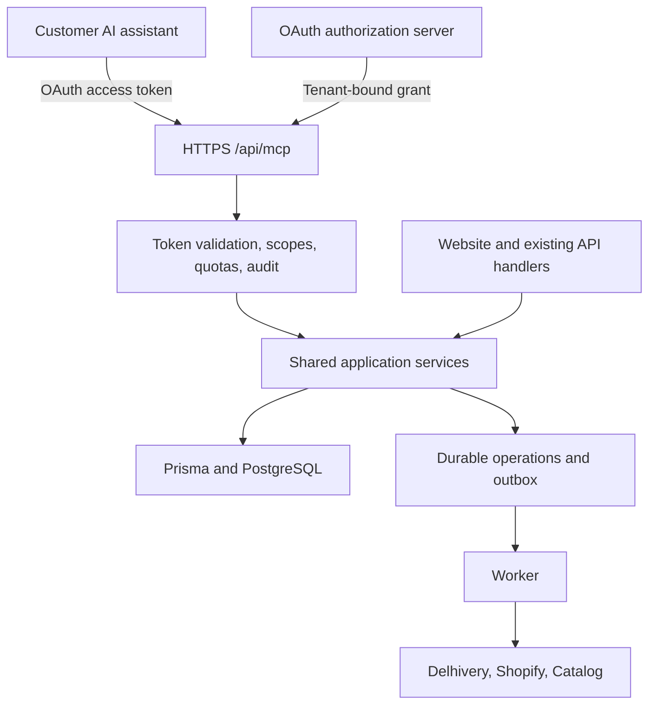

# Scan2Ship audit and customer MCP implementation plan

Date: 2026-09-29 · Repository commit: `6c639f6`

> Historical baseline and implementation log. For the current `feature/mcp-implementation` assessment at `3d13739`, see the [branch re-audit](/Users/karthiknaidudintakurthi/Documents/GitHub/scan2ship/docs/audits/MCP_BRANCH_REAUDIT_3d13739.md). Several findings below have since been fixed or removed; the re-audit records remaining defects and current verification results.

## Recommendation

Build a remote MCP server that lets customers connect their own AI assistants to their Scan2Ship account. Start with order search, shipment status, shipping estimates, and account configuration. Add shipment creation and pickup booking after authorization, billing, and retry handling are repaired.

The application has useful business capabilities, but its current API surface is **not ready for customer MCP access**. Several existing routes allow unauthorized access or mutations. These must be fixed even if MCP exposes only safe read tools: a vulnerable registration route can compromise the identity on which MCP relies.

Use a thin MCP adapter over shared, tenant-aware services in this repository. Customer tokens must be restricted to one Scan2Ship tenant and the connecting user's permissions. Keep platform administration outside the customer MCP product.

## 1. Scope and evidence

This is a source audit focused on MCP readiness, with local TypeScript, lint, and Jest checks. I inspected authentication, API keys, order reads and writes, credits, tracking, pickup requests, labels, Catalog integration, Shopify OAuth, webhooks, schema, deployment configuration, and the earlier audit.

No production requests, database queries, migrations, carrier bookings, payments, or deployments were performed. Production configuration, current credential exposure, actual query performance, dependency advisories, and end-to-end UI behavior were not independently verified. The findings below establish source-level defects, not observed production exploitation. This is not an exhaustive penetration test of every handler.

### Current repository baseline

| Area | Observed state |
|---|---|
| Application | Next.js 15.5.9, React 19.1, TypeScript, Prisma 6, PostgreSQL |
| Surface | 89 `route.ts` files, 29 Prisma models, 36 migrations; one label route is entirely commented out |
| Identity | Custom JWT authentication, five roles, tenant API keys; subgroup and pickup assignments |
| Business capabilities | Orders, Delhivery shipments, manual courier workflows, labels, tracking, credits, Shopify, external Catalog |
| Hosting configuration | Vercel; API function duration configured as 30 seconds |
| MCP | No MCP implementation or SDK dependency found |
| Customer OAuth for MCP | Not implemented; Shopify OAuth serves a different integration |
| TypeScript | `tsc --noEmit --incremental false`: **323 errors**, including existing generated `.next` route types |
| Lint | `npm run lint`: fails loading missing `@typescript-eslint` plugin configuration |
| Tests | `npm test -- --runInBand --watch=false`: **3 suites pass, 8 fail; 78–79 tests pass, 54–55 fail, 5 skipped** (138 total; one test changed outcome between two runs, so treat it as flaky) |
| CI | No tracked `.github` workflows found |

Five Jest suites fail to import their target route because of incorrect relative paths. Other failures include order tests and validation assertions. The existing tests mock authorization and database behavior, so the passing tests do not demonstrate tenant isolation.

The August audit is useful background, but two assertions are outdated: Jest now executes tests, and `orders` now has two composite indexes for customer/reseller history. General order listing and tracking still need query-specific index review. Build-time TypeScript and lint checks remain disabled in [next.config.ts](/Users/karthiknaidudintakurthi/Documents/GitHub/scan2ship/next.config.ts:3).

## 2. Confirmed findings

Every finding below was re-verified against commit `6c639f6` on 2026-09-29, and the line references point to the cited code. That verification pass also found several unauthenticated mutation routes that the original draft missed; they are added to the tables below.

Priority describes remediation order. Critical findings are release blockers for any customer pilot. High findings block the affected capabilities and must have explicit resolution before those tools ship.

### Critical: identity, tenant access, and money

| Finding | Evidence and impact | Required change |
|---|---|---|
| Public registration accepts tenant and role | [register-user](/Users/karthiknaidudintakurthi/Documents/GitHub/scan2ship/src/app/api/auth/register-user/route.ts:5) has no authentication and persists caller-supplied `clientId` and `role`. A caller who knows an active tenant ID can create a privileged identity. | Require authorized invitations/admin creation; validate allowed roles; derive tenant from authenticated context. Separate public tenant signup from joining an existing tenant. |
| Order detail read/update omit tenant restrictions | [order GET](/Users/karthiknaidudintakurthi/Documents/GitHub/scan2ship/src/app/api/orders/[id]/route.ts:38) queries by numeric order ID alone. [PUT](/Users/karthiknaidudintakurthi/Documents/GitHub/scan2ship/src/app/api/orders/[id]/route.ts:136) updates by ID and passes the entire body into Prisma. | Apply tenant plus user/subgroup policy to every operation; explicitly allow editable fields. Reject attempts to set tenant, creator, billing, or provider state. DELETE has a tenant check, illustrating the inconsistency. |
| Administrative mappings expose credentials without authentication | [cross-app mappings](/Users/karthiknaidudintakurthi/Documents/GitHub/scan2ship/src/app/api/admin/cross-app-mappings/route.ts:26) comments out admin authorization; GET returns complete mapping rows, including `catalogApiKey`. POST and [DELETE by ID](/Users/karthiknaidudintakurthi/Documents/GitHub/scan2ship/src/app/api/admin/cross-app-mappings/[id]/route.ts:92) also bypass authorization; only PUT by ID enforces it. | Restore platform-admin enforcement across mapping handlers; return credential-free DTOs; assess exposure and rotate affected credentials. |
| Credits can be granted from an unverified claim | [verify-payment](/Users/karthiknaidudintakurthi/Documents/GitHub/scan2ship/src/app/api/credits/verify-payment/route.ts:54) accepts caller amount/reference from any active user down to `CHILD_USER`. Duplicate detection is only a substring match on the ledger description. It then [adds credits](/Users/karthiknaidudintakurthi/Documents/GitHub/scan2ship/src/app/api/credits/verify-payment/route.ts:115) without payment-provider verification. | Require independently verified settlement or an authorized manual reconciliation workflow. Enforce a unique provider payment ID and atomic posting. |
| Public phone lookup returns customer data across tenants | [tracking](/Users/karthiknaidudintakurthi/Documents/GitHub/scan2ship/src/app/api/tracking/route.ts:4) needs only a phone number and returns addresses, order values, and tenant-grouped shipments. | Tenant-authenticated lookup for MCP; if public tracking is retained, use an appropriately scoped secret link or verified customer flow with minimal output. |
| Unauthenticated shipment edits use any tenant's carrier key | [delhivery/update-order](/Users/karthiknaidudintakurthi/Documents/GitHub/scan2ship/src/app/api/delhivery/update-order/route.ts:6) has no authentication. It looks up a pickup location by `value` alone ([line 40](/Users/karthiknaidudintakurthi/Documents/GitHub/scan2ship/src/app/api/delhivery/update-order/route.ts:40)), with no tenant filter, and uses that location's `delhiveryApiKey` to send caller-supplied waybill, address, phone, payment type, and COD changes to Delhivery. | Remove the route or put it behind tenant authorization; resolve the waybill to a tenant-owned order and use that order's pickup credential. Review Delhivery edit history for unexpected changes. |
| Platform-admin routes accept ordinary tenant users | Fourteen route files pass `requiredRole: UserRole.ADMIN` to `authorizeUser`, but the enum has no `ADMIN` member. The value is `undefined`, so the [destructuring default](/Users/karthiknaidudintakurthi/Documents/GitHub/scan2ship/src/lib/auth-middleware.ts:331) substitutes `UserRole.USER`. Any `user`-level account in any tenant can therefore add credits to any tenant ([admin credits](/Users/karthiknaidudintakurthi/Documents/GitHub/scan2ship/src/app/api/admin/credits/[clientId]/route.ts:72)), create users with any role in any tenant ([admin users](/Users/karthiknaidudintakurthi/Documents/GitHub/scan2ship/src/app/api/admin/users/route.ts:83)), list every tenant's users with password hashes, and read JWT secret statistics and platform analytics. System configuration also requires the `ADMIN` permission, so any tenant's `client_admin` could change it. `authorizeAdmin` had the same defect. A regression test that goes through `authorizeUser` confirms `user` and `client_admin` accounts could grant credits to another tenant. Fixed in `f0d7b71`. | Replace `UserRole.ADMIN` with an explicit platform-admin role; make role checks reject unknown required roles instead of defaulting; review credit and user changes made through these routes. |

### High: operations and MCP boundaries

| Finding | Evidence and impact | Required change |
|---|---|---|
| Side-effect routes lack authorization | [fulfill](/Users/karthiknaidudintakurthi/Documents/GitHub/scan2ship/src/app/api/orders/[id]/fulfill/route.ts:19) looks up orders and calls integrations without authenticating; [fix-database](/Users/karthiknaidudintakurthi/Documents/GitHub/scan2ship/src/app/api/admin/fix-database/route.ts:4) lets anyone run a fixed `ALTER TABLE` on `orders`. Other unauthenticated routes write to any tenant's orders by ID: [admin/update-order-status](/Users/karthiknaidudintakurthi/Documents/GitHub/scan2ship/src/app/api/admin/update-order-status/route.ts:4), [tracking/update-single](/Users/karthiknaidudintakurthi/Documents/GitHub/scan2ship/src/app/api/tracking/update-single/route.ts:5), and [cron/test-tracking](/Users/karthiknaidudintakurthi/Documents/GitHub/scan2ship/src/app/api/cron/test-tracking/route.ts:5), which reads and updates orders across tenants. The [Delhivery webhook](/Users/karthiknaidudintakurthi/Documents/GitHub/scan2ship/src/app/api/webhooks/delhivery/route.ts:78) accepts unsigned payloads, updates orders by AWB across tenants, and pushes tracking to a hard-coded Shopify store with an admin token. | Protect fulfillment with tenant/action policy. Remove the database-repair, test, and ad hoc status routes from the public API. Require a secret or signature on webhooks and cron routes. Also review `debug-env`, `test-auth`, `test-catalog`, `catalog-simple`, and `cache/clear`, which have no authentication. |
| Creation and billing cannot safely handle retries | [main order creation](/Users/karthiknaidudintakurthi/Documents/GitHub/scan2ship/src/app/api/orders/route.ts:203) checks the balance ([line 52](/Users/karthiknaidudintakurthi/Documents/GitHub/scan2ship/src/app/api/orders/route.ts:52)), calls the carrier before inserting the order, then [swallows debit failures](/Users/karthiknaidudintakurthi/Documents/GitHub/scan2ship/src/app/api/orders/route.ts:275). A booked shipment can therefore end up unpaid. [Credit deduction](/Users/karthiknaidudintakurthi/Documents/GitHub/scan2ship/src/lib/credit-service.ts:144) reads a balance and then writes an absolute value inside an interactive transaction, with no conditional decrement or explicit concurrency control. At PostgreSQL's default Read Committed isolation, two concurrent debits can both succeed, and one of them is lost. | Durable operation IDs, conditional credit reservation/debit, unique ledger operations, and reconciliation of ambiguous provider results. A database transaction alone cannot atomically include carrier calls. |
| Partner API implements different order semantics | [external order POST](/Users/karthiknaidudintakurthi/Documents/GitHub/scan2ship/src/app/api/external/orders/route.ts:122) inserts request data, separately decrements one credit, and separately creates a ledger row. It does not run the main carrier workflow. | Make website, external API, and MCP call one order/shipment service. Distinguish draft creation from paid booking in the public contract. |
| API keys lack safe delegation | [key management](/Users/karthiknaidudintakurthi/Documents/GitHub/scan2ship/src/app/api/api-keys/route.ts:96) accepts arbitrary permission strings; GET returns raw keys. [Key auth](/Users/karthiknaidudintakurthi/Documents/GitHub/scan2ship/src/lib/api-key-auth.ts:28) looks up plaintext values and accepts wildcard permission. Keys have tenant identity but no user/subgroup identity. | OAuth grants for customers. For retained machine keys, hash keys, show once, cap scopes to issuer privileges, record principal, expire/revoke, and log usage. |
| Tracking refresh crosses tenants and can mismatch shipments | [refresh-statuses](/Users/karthiknaidudintakurthi/Documents/GitHub/scan2ship/src/app/api/orders/refresh-statuses/route.ts:31) filters submitted IDs without `clientId`; [result assignment](/Users/karthiknaidudintakurthi/Documents/GitHub/scan2ship/src/app/api/orders/refresh-statuses/route.ts:121) pairs results by array position and starts from the first order in every batch. It also uses the tenant's first pickup location that has a key, not the order's own pickup location. | Authorize each order; match by carrier tracking ID and correct pickup credentials; test reordered/missing responses and batches above 50. |
| Carrier credentials can be selected without tenant scope | [credential lookup](/Users/karthiknaidudintakurthi/Documents/GitHub/scan2ship/src/lib/pickup-location-config.ts:153) makes `clientId` optional. [Cancellation caller](/Users/karthiknaidudintakurthi/Documents/GitHub/scan2ship/src/app/api/orders/[id]/route.ts:266) parses a string tenant ID as an integer. The resulting `NaN` is falsy, so the lookup drops the tenant filter and matches the pickup name across all tenants. | Require string tenant identity at every provider boundary; use a tenant-owned pickup ID; fail closed when no matching credential exists. |
| Secrets reach logs and ordinary read responses | [Delhivery logging](/Users/karthiknaidudintakurthi/Documents/GitHub/scan2ship/src/lib/delhivery.ts:92) prints raw keys and headers; [order updates](/Users/karthiknaidudintakurthi/Documents/GitHub/scan2ship/src/app/api/orders/[id]/route.ts:108) dump request headers. [Pickup GET](/Users/karthiknaidudintakurthi/Documents/GitHub/scan2ship/src/app/api/pickup-locations/route.ts:73) returns complete rows containing `delhiveryApiKey`, including to `CHILD_USER` accounts. | Explicit output schemas, redacted structured logs, credential rotation based on exposure, and restricted integration-secret storage. |
| Shopify token exchange trusts a supplied host | [Shopify callback](/Users/karthiknaidudintakurthi/Documents/GitHub/scan2ship/src/app/api/shopify/auth/route.ts:124) sends the app secret to `https://${shop}`. It checks stored state but never compares the supplied shop with the stored one, and it does not validate the shop domain or Shopify's HMAC. [Initiation](/Users/karthiknaidudintakurthi/Documents/GitHub/scan2ship/src/app/api/shopify/auth/route.ts:6) is unauthenticated and takes `client_id` from the query string, so anyone can link a store to any tenant. It checks the domain with only an `endsWith('.myshopify.com')` test. | Authenticate initiation, validate canonical Shopify domains, bind shop/tenant/redirect to single-use state, and prevent arbitrary destinations. |

### Other changes needed for reliable MCP

- **One authorization policy:** `UserRole.ADMIN` is referenced but absent from the enum in [auth-middleware](/Users/karthiknaidudintakurthi/Documents/GitHub/scan2ship/src/lib/auth-middleware.ts:423). JWT verification falls back to verification without issuer/audience at line 147. MCP needs its own strict token validation and shared business authorization. Recheck active user, tenant, grant, and entitlement on calls; do not copy the JWT fallback.
- **Separate read and write actions:** [Catalog dispatch](/Users/karthiknaidudintakurthi/Documents/GitHub/scan2ship/src/app/api/catalog/route.ts:30) requires only READ but includes inventory reduction/restoration. MCP must expose individually authorized operations, not a generic action proxy.
- **Implement webhook delivery before promising notifications:** [getActiveWebhooks](/Users/karthiknaidudintakurthi/Documents/GitHub/scan2ship/src/lib/webhook-service.ts:28) always returns `[]`. Durable jobs and delivery retries are needed; enabling this lookup alone is insufficient. Validate webhook destinations against SSRF, sign payloads, and use replay protection.
- **Consolidate database access:** several modules instantiate Prisma, including credential lookup per invocation. Use one shared client module per runtime and size pooling for deployment concurrency. Review indexes for `(clientId, created_at, id)` and `(clientId, tracking_id)` against representative queries.
- **Make monetary units explicit:** order values/rates are `Float`; credit balances and ledger amounts are `Int`, while per-tenant costs are `Float`. Choose integer minor units or appropriate decimals and reconcile existing data before migration.
- **Repair release checks:** fix lint configuration, broken test imports/mocks, and type errors; restore build enforcement and CI. Do not treat the existing successful bundle build as a quality gate. Review missing npm-script targets in a clean checkout.
- **Validate deployment separately:** production builds can run migrations via [run-migrate-if-production.js](/Users/karthiknaidudintakurthi/Documents/GitHub/scan2ship/prisma/run-migrate-if-production.js:9). Use reviewed additive migrations and a controlled release step with backup/rollback planning.

## 3. Proposed architecture



### Deployment choice

Keep the initial adapter in the Next.js app at `/api/mcp`, using the Node runtime and a request-scoped MCP server. This avoids an extra service deployment while business logic is extracted. Use separate durable workers for carrier bookings and other long operations; the current 30-second request budget is unsuitable for unbounded provider retries. Never launch untracked background work after a serverless response.

Use remote Streamable HTTP and JSON responses for the initial tools. The current protocol revision is `2026-07-28`; it uses POST requests and removes the old protocol session model. Delegate protocol handling and compatibility to the SDK, and validate the actual pilot clients. [MCP transport specification](https://modelcontextprotocol.io/specification/2026-07-28/basic/transports/streamable-http)

The official TypeScript SDK currently documents v2 as stable, with `@modelcontextprotocol/server`. Pin a tested version and use a schema library such as Zod v4. [Official SDK](https://ts.sdk.modelcontextprotocol.io/v2/)

The SDK supplies a Web Request/Response handler suitable for adapting to a Next route. Explicitly add host/origin checks and authenticated context; these are not inferred automatically by that handler. The Next/Vercel integration remains a spike to verify, not a completed implementation. [Web-standard handler documentation](https://ts.sdk.modelcontextprotocol.io/v2/serving/web-standard.html)

Move the adapter into a standalone service later if independent scaling, connection duration, or operational ownership requires it. A separate deployment does not replace shared authorization.

### Proposed code boundaries

```text
src/app/api/mcp/route.ts               transport and HTTP boundary
src/lib/mcp/server.ts                 SDK setup and tool registration
src/lib/mcp/auth.ts                   token validation -> principal
src/lib/mcp/tools/                    small tool handlers and output mapping
src/lib/application/policy.ts         tenant, role, subgroup, pickup, entitlement checks
src/lib/application/orders.ts         search, detail, draft and order lifecycle
src/lib/application/shipping.ts       booking and provider reconciliation
src/lib/application/credits.ts        atomic reservation/debit/refund
src/lib/application/operations.ts     durable operations and idempotency
src/lib/application/schemas.ts        shared validated contracts
src/app/settings/connections/         connect, permissions, revoke, activity
```

These are proposed files. Existing routes should call the extracted services directly. Avoid calling the app's own HTTP routes from MCP or forwarding an MCP bearer token to carriers.

## 4. Customer identity and consent

Customer flow: connect the server URL in an assistant → sign in to Scan2Ship → select an authorized tenant → see the assistant name and requested permissions → approve → manage or revoke the connection in Settings.

Build the OAuth authorization server into Scan2Ship, backed by the existing `users` table, using a maintained OAuth library rather than hand-written protocol code. It must support authorization code with PKCE, exact redirect validation, short-lived access tokens, refresh rotation/reuse detection, and revocation. The library is chosen during the Phase 2 spike. The MCP resource server must publish protected-resource metadata and enforce tokens issued for its canonical audience. Current MCP guidance prefers Client ID Metadata Documents; support pre-registration and legacy dynamic registration only as required by tested clients. [MCP authorization specification](https://modelcontextprotocol.io/specification/2026-07-28/basic/authorization)

Implementation policy:

- Distinguish SaaS `clientId` (tenant) from OAuth `client_id` (assistant application).
- Derive an immutable principal containing `tenantId`, `userId`, `grantId`, granted scopes, current role, subgroup/pickup restrictions, and request ID.
- Effective access is the intersection of consent, current user permissions, tenant entitlements, and resource ownership. A scope never grants authority the user does not have.
- One grant authorizes one tenant. Tools cannot accept a tenant override. Platform admins connecting through this product remain bounded to the selected tenant.
- Validate issuer, audience/resource, expiry, signature algorithm, and current grant/user/tenant status. Revocation must take effect through a grant check or bounded cache invalidation, not only eventual token expiry.
- Pass provider credentials only to their intended integration, resolved inside the service. MCP tokens must not be passed through to downstream APIs. [MCP security guidance](https://modelcontextprotocol.io/docs/2026-07-28/tutorials/security/security_best_practices)

Initial scopes: `orders:read`, `tracking:read`, `shipping:quote`, `settings:read`, `credits:read`. Add `customers:read` and `labels:read` for explicit PII access. Later add `orders:draft`, `shipments:create`, and `pickups:create` separately. API keys remain an optional machine-integration path after hardening; they are not the default customer connection experience.

## 5. Tool roadmap

Names and boundaries below are proposed contracts, not current endpoints.

### First customer release

| Tool | Scope | Existing starting point and required behavior |
|---|---|---|
| `get_account_context` | `settings:read` | Safe tenant identity, supported capabilities, units, relevant feature flags; no credentials or admin configuration |
| `search_orders` | `orders:read` | Extract main/external list queries; bounded filters, stable cursor pagination, tenant plus subgroup policy, minimal list fields |
| `get_order` | `orders:read` | Repair current detail access; return an explicit DTO, not a Prisma row; require additional permission for full customer contact/address |
| `get_tracking_status` | `tracking:read` | Return tenant-owned persisted status with freshness timestamp and source; initial read does not silently refresh/write carrier state |
| `list_shipping_options` | `settings:read` | Combine safe courier configuration and permitted pickup locations; remove API keys |
| `quote_shipping` | `shipping:quote` | Extract configured rate calculation; label result `configured_estimate`, include INR and weight units; current code is not a live carrier quote |
| `get_credit_balance` | `credits:read` | Explicit balance/units only; ensure read does not initialize or modify accounts as a side effect |

After the initial read pilot, add `get_customer_order_history` with `customers:read`, preserving the tenant's existing history feature flag and time window, plus user/subgroup policy. Add `get_shipping_label` with `labels:read` once rendering is verified. Reuse the universal waybill path and label generators; the old `/shipping-label` route is commented out. Deliver an authenticated download or short-lived signed artifact URL, with expiry and content type, rather than raw printable HTML or large base64 payloads in model context.

Useful customer requests include “show my shipments awaiting dispatch,” “find this order's last tracking update,” and “estimate shipping for a 500 g prepaid package.” These should work without exposing admin tools.

### Controlled writes

1. `prepare_shipment`: validate recipient/package, permitted pickup, courier capability, stock where applicable, and cost. Save a draft/preview; return exact effects and expiry.
2. `commit_shipment`: act on an approved, unchanged preview using an idempotency key; return an operation ID and current state.
3. `get_operation`: tenant-authorized polling for completion, failure, or required reconciliation.
4. `prepare_pickup` / `commit_pickup`: show pickup date/time, timezone, location, count, and any known cost before booking.

Billable writes should require a confirmation recorded through the authenticated Scan2Ship UI for the first release. Bind it to tenant, user, operation, payload hash, price, and expiry; consume it once. A model-supplied `confirmed: true` is not proof of user approval. Revalidate permissions, state, and credit availability at execution; changed price or payload requires renewed approval.

Defer bulk shipment actions, cancellation/deletion, inventory adjustment, user administration, key management, credit recharge, and arbitrary webhook registration. Each needs its own audited workflow. Address parsing also has a charge and sends data to an AI provider; add it later with an explicit cost/data contract.

## 6. Contracts, safety, and operations

- Validate inputs and outputs. Use integer order IDs, positive limits (default 20, max 100), capped search/date ranges, explicit grams/centimeters/INR, and strict COD amount rules. Reject unknown mutation fields.
- Return structured results and a short text summary, stable error codes, request/operation IDs, and whether retry is safe. Keep authentication failures at the HTTP/OAuth boundary and business failures in the SDK's tool-error format.
- Separate “not found or inaccessible” from validation errors without revealing another tenant's resources. Authorization applies to resources and downloads as well as tools.
- Use accurate tool annotations for read, destructive, idempotent, and external effects. Enforce permissions in code; annotations are descriptive hints.
- Optional resources: `scan2ship://account/capabilities` and `scan2ship://shipping/options`, protected by the same policy. Optional workflow prompts can come later; first-release functionality must work through tools alone.
- Treat addresses, product descriptions, carrier messages, and other returned text as untrusted content. Return bounded data fields and never execute embedded instructions or fetch arbitrary user-supplied URLs.
- Apply quotas by tenant, grant, and tool cost, with shared storage across instances. Cap concurrent writes and carrier batches. Redact phone/address data in routine logs; never log tokens or provider keys.
- Preserve an audit trail with actor, tenant, grant, tool, target IDs, result, duration, billing operation, and correlation ID. Keep security and billing events durable; avoid retaining full customer payloads by default.
- Read-only tools should not deduct shipping credits. Define any future MCP subscription or usage charge explicitly before launch.

### Write reliability

Persist a unique `(tenantId, operationType, idempotencyKey)` with payload hash and result. Same key/same payload returns the existing operation; same key/different payload returns a conflict. Do not use the MCP JSON-RPC request ID as the business idempotency key.

In one database transaction: authorize and validate current state, create the operation/draft, conditionally reserve sufficient credits, and insert an outbox job. A worker calls the carrier outside that transaction, persists the result, and posts exactly one debit or release/refund using a unique ledger operation reference. Use bounded retries and worker leases.

On a timeout after a provider might have accepted a booking, mark `reconciliation_required` and query by a stable provider reference before retrying. Only automate retry where provider guarantees support it; otherwise route the ambiguity to operations. Cross-system exactly-once execution cannot be promised from a local database transaction.

For multi-provider work, persist each step independently: carrier booking, Catalog inventory effect, Shopify fulfillment. Retry only failed steps and show partial completion. Cancelling a client request does not establish that a provider booking was cancelled.

### Proposed persistence additions

| Record | Purpose |
|---|---|
| `mcp_connections` / grants | Tenant, user, OAuth application, consented scopes, policy version, expiry/revocation; token storage owned by the selected auth provider where possible |
| `operation_requests` | Idempotency uniqueness, payload hash, preview/approval binding, state, result, actor |
| `outbox_jobs` | Durable dispatch, attempts, lease, next retry, provider reference |
| Credit ledger extension | Unique operation reference, reservation/debit/refund association, explicit units |
| Audit extension | MCP grant/tool identity and correlation with existing audit records |

Use additive migrations first. Reconcile existing balances before changing monetary representations; retain ledger history. Choose the durable worker runtime and storage during the deployment spike.

## 7. Implementation sequence and release gates

Estimates are engineering effort for one experienced full-time engineer with timely infrastructure access and review. They are planning ranges, not delivery commitments; the failing baseline is the largest uncertainty.

| Phase | Deliverable | Estimate | Exit gate |
|---|---|---:|---|
| 0. Contain and stabilize | Close critical auth/data/payment gaps, including `delhivery/update-order`; remove or lock down the public repair, test, status-update, and cron routes; sign the Delhivery webhook; fix Shopify OAuth initiation; redact secrets; restore test/lint tooling and assess type backlog | 10–17 days | Critical paths protected; no route in `src/app/api` mutates data without authentication, a signature, or a cron secret; tenant/role regression tests execute; clear baseline and dependency review |
| 1. Shared services | Principal/policy layer, scoped read services, output schemas, database-client consolidation, initial index review | 5–8 days | Cross-tenant and subgroup tests pass for every pilot capability; existing UI paths retain intended behavior |
| 2. Customer MCP reads | SDK/Vercel spike, self-hosted OAuth authorization server, consent/revocation UI, seven tools, quotas and audit | 10–16 days | Two selected customer assistant clients connect, read, expire/refresh, and revoke correctly |
| 3. Read pilot | Small tenant allowlist, staging/load/security checks, support docs and dashboards | 3–5 days | No unresolved critical/high issue on the pilot path; tenant isolation proven; rollback drill complete |
| 4. Shipment writes | Preview/approval, atomic credits, durable jobs, provider reconciliation, pickup workflow, operation status | 10–18 days | Concurrency, duplicate, crash, timeout, revocation, and compensation tests pass |

Indicative total: **28–46 engineering days for a read pilot; 38–64 for controlled writes**. Building the authorization server in-house, rather than using a managed provider, adds about 4–6 days to Phase 2 and keeps its security review in scope. Re-estimate after Phase 0. Full general availability also requires resolving the remaining type/test failures, restoring build gates, and a deployment/dependency security review. Do not let unrelated existing failures hide new errors: use a temporary tracked baseline while repairing them, with strict checks for all new services.

### Required acceptance tests

1. Tenant A cannot search, read, mutate, poll, or download Tenant B's data, even with guessed IDs, altered cursors, or copied operation IDs.
2. Child-user subgroup and pickup restrictions are consistent across list, detail, history, labels, and writes. Disabled users, tenants, revoked grants, and expired entitlements are rejected.
3. Invalid audience/issuer, expired tokens, wrong scopes, invalid origin, OAuth state/PKCE failures, and altered approval payloads are rejected.
4. API key, access token, carrier secret, and unnecessary customer data never appear in tool output or logs.
5. Concurrent commits and repeated requests produce one operation and one ledger effect. Insufficient balance prevents booking. Key reuse with a changed payload fails.
6. Carrier success followed by database failure, network timeout, worker restart, and partial Shopify/Catalog failures can be reconciled without blind rebooking.
7. Tracking results reordered, omitted, or spanning more than 50 shipments update the correct tenant-owned orders.
8. MCP discovery/tool calls, schema validation, pagination, error responses, token refresh and revocation work in the two chosen real clients. Test each client's supported protocol revision; do not assume universal compatibility.
9. Read responses and operation submissions fit the deployed timeout under representative concurrency. Slow provider work remains recoverable after the initiating request ends.
10. A tenant feature flag and global kill switch disable MCP writes immediately. Queued jobs recheck revocation/authorization before irreversible steps and preserve work already accepted by providers for reconciliation.

## 8. First development milestone

Create the policy/service foundation and demonstrate one complete flow in staging:

**Customer connects → approves `orders:read` for their tenant → searches their own orders → cannot access another tenant's order → revokes access → the next call is denied.**

Ship that with regression tests, redacted audit records, and a documented client compatibility result before expanding the tool catalog. This proves the most important product and security boundary with a small, reviewable implementation.

## 9. Decisions and pull request sequence

### Decisions (2026-09-29)

| Topic | Decision |
|---|---|
| Credit recharge | `verify-payment` creates a pending request that a platform admin approves in the existing admin credits UI. A payment gateway with verified webhooks replaces manual approval later. |
| Public tracking | Keep phone lookup, return only masked minimal fields, and rate-limit by IP. |
| OAuth for MCP | Self-hosted authorization server in Scan2Ship, using a maintained OAuth library. |

### Existing callers that constrain the fixes

These routes must be repaired, not deleted, because the UI calls them: `register-user` (admin add-user page, through `AuthContext`), `delhivery/update-order` and `orders/[id]/fulfill` (`OrderList`), `credits/verify-payment` (`RechargeModal`), `/api/tracking` (public `/tracking` page), and pickup-location reads that include `delhiveryApiKey` (settings and admin client pages). `OrderList` currently calls `delhivery/update-order` without an `Authorization` header.

### Phase 0 pull requests

Each PR is independently shippable and carries route-level tests. Ordered by exploitability and cost.

1. **Admin role check (done in `f0d7b71`).** Replace `UserRole.ADMIN` with `SUPER_ADMIN` in the 14 affected files, with tenant rules where the route is tenant-level. Make `hasRequiredRole` deny unknown roles and `authorizeUser` reject an unknown `requiredRole`.
2. **Delete unused public routes (done in `a261180`).** `admin/fix-database`, `admin/update-order-status`, `cron/test-tracking`, `test-catalog`, `catalog-simple`, `debug-env`, `test-auth` with the `debug-auth` page, `cache/clear`, and `test-clear-cache`.
3. **Scoped order access (done in `d186660`).** A shared `findAccessibleOrder(user, id)` applying tenant and child-user sub-group/creator rules, used by order detail GET/PUT/DELETE, `fulfill`, `delhivery/update-order`, and `tracking/update-single`. Allowlist PUT fields; remove header and payload dumps. Resolve carrier keys server-side from the order's pickup location. Also covered `orders/[id]/retry-delhivery`, which let any tenant user book a Delhivery shipment on another tenant's order, and whose error path referenced an out-of-scope variable. `tracking/update-single` and the unused `TrackingStatusLabel` component were deleted instead of fixed. The waybill route checks the tenant but not the child-user sub-group rule; that is left for the Phase 1 label work.
4. **Carrier credential scoping (done in `4b036ee`).** `getDelhiveryApiKey` requires a string tenant ID and fails closed; fix the cancellation `parseInt`; `refresh-statuses` filters by tenant, matches by waybill, uses each order's pickup key, and fixes batching. Also found a Delhivery API key hard-coded in `defaultPickupLocationConfig` (`src/lib/pickup-location-config.ts`) since the first commit. It was not used for API calls and is now blank, but it remains in git history and must be rotated with the PR 6 rotation.
5. **Registration (done in `bf1b87f`).** `register-user` requires `CLIENT_ADMIN` or higher, takes the tenant from the session (platform admins may choose), and cannot grant a role above the caller's.
6. **Credential exposure (done in `bb01fce`).** Authorize all cross-app mapping handlers and return key-free DTOs; pickup reads return `hasApiKey`; settings forms keep an existing key when left blank; remove raw-key logging. Rotate Delhivery and Catalog keys after release.
7. **Credits (done in `0936240` and `cb3096c`).** Pending recharge requests with a unique UTR and admin approval; conditional credit decrement; order creation stops ignoring debit failures.
8. **Public tracking (done in `23f289a`).** Minimal masked output and IP rate limiting.
9. **Shopify removed; Delhivery webhook signed.** The Shopify integration moved to scan2ship-b2b. The Delhivery webhook requires `DELHIVERY_WEBHOOK_SECRET` (header or query token), is IP rate-limited, matches `tracking_id` or `delhivery_waybill_number`, and refuses to update when the same AWB exists on more than one order.

10. **Partner API keys (done in `84968b6`).** Store only a hash of each key and show the raw key once at creation; stop returning keys from `GET /api/api-keys`; accept only known permission scopes and never `*`; record the issuing user; keep expiry and revocation.
11. **Catalog proxy permissions (done in `09a3be1`).** `/api/catalog` accepts any action with READ permission, including `reduce_inventory` and `restore_inventory`. Require WRITE for inventory changes and reject unknown actions.

### Findings from implementing PRs 5–8

- **Rate limiting never blocks.** Fixed: every tier now uses `consumeFixedWindow`. Tracking/auth/webhook buckets are IP-based; signed-in API traffic is keyed by JWT `userId`/`sub`; API keys are keyed by a hash of the full token. The middleware still skips rate limiting when `NODE_ENV` is `development` or `test`.
- **Order creation accepts arbitrary order fields.** Fixed: `POST /api/orders` and the external orders API take only `CREATABLE_ORDER_FIELDS`. Delhivery creates ignore caller-supplied `tracking_id` / `waybill` so a tenant cannot collide with another tenant's AWB on the webhook.
- **Fulfillment is not charged.** Fixed: `fulfill` and `retry-delhivery` charge one ORDER credit unless that order already has a debit (create-order already billed it). A new charge is refunded if Delhivery rejects the booking.
- **Local database drift.** `prisma migrate status` reports the local database as up to date, but `prisma migrate diff` against `schema.prisma` produces a large destructive script: it drops `catalog_sessions` and `otp_sessions`, drops columns on `orders`, `shopify_orders`, and `webhook_logs`, and rewrites several primary keys. The committed migrations do not describe the database. PR 7's migration was hand-trimmed to the new table only. Check production for the same drift before running `migrate dev` anywhere.
- **UTR is optional on recharge requests.** Admin approval is the control, but requests without a UTR are harder to verify; consider requiring one in the recharge form.
- **Parallel Jest workers crash loading the Next SWC binary** in this environment; the suites pass with `--runInBand`. CI should run in band until this is understood.

### Findings from implementing PRs 10–11

- **`api_keys` has drifted.** The local table has an integer `id` and an integer `clientId`, while tenant IDs are strings and `schema.prisma` says `String`, so issuing API keys cannot work against that database. PR 10's migration only adds columns and rewrites values, so it applies whatever the column types are; confirm the production table shape before relying on partner keys.
- **Every tenant role has WRITE.** `child_user` holds READ, WRITE, and DELETE, so permission-level checks like "requires WRITE" do not separate roles today. PR 11 therefore binds inventory reduction to an accessible order instead of relying on the permission alone.
- **Catalog reductions are not idempotent on the Scan2Ship side.** Repeating `reduce_inventory` for the same order sends the same `scan2ship_order_<id>` reference; whether Catalog ignores the repeat depends on the Catalog app.

### Pilot close-out and write blockers (2026-09-29)

- **Role actions.** `src/lib/application/permissions.ts` maps each role to tenant actions (`can(user, action)`); unknown roles get none. `PermissionLevel` is unchanged, but it can no longer be the only check for a sensitive action. Child users lost `settings:write`: `POST /api/courier-services` (JWT path), `PUT`/`POST`/`DELETE /api/logo`, and `PUT /api/order-config` now return 403 for them. The settings page is already hidden from child users. `dtdc-slips` PUT stays open because order creation calls it to consume a slip.
- **MCP scope ceiling.** Scopes are capped by role at consent and on every call. `userFromGrant` rejects unknown roles instead of defaulting to `child_user`. `createAuthorizationCode` no longer re-expands an empty scope list to the defaults. `MCP_POLICY_VERSION` is 2 (recorded on grants, not enforced).
- **Waybill access.** `GET /api/orders/[id]/waybill` uses `findAccessibleOrder`, so the child-user sub-group rule applies and other tenants' orders return 404. It also uses the shared Prisma client.
- **Release checks.** ESLint loads (`next/typescript` was missing) and reports 0 errors; `lint:ci` caps warnings at 445. `npm run typecheck` fails on any TypeScript error missing from `typecheck-baseline.txt` (226 known errors). `test:ci` runs in band and quarantines seven legacy suites listed in `jest.ci.config.js`; they now import their routes but assert an older API and need rewriting. `.github/workflows/ci.yml` runs all three. Build-time type and lint checks stay disabled in `next.config.ts` until the baseline reaches zero.
- **Production drift.** Production shows the same drift as the local copy. `prisma migrate diff` from production to `schema.prisma` is a 527-line destructive script: it drops `otp_sessions` and `catalog_sessions`, drops the Shopify columns on `orders`, reshapes `webhook_logs`, `audit_logs`, and `shopify_orders`, and converts integer IDs on `api_keys`, `webhooks`, `webhook_logs`, `shopify_orders`, and `audit_logs` to text. `_prisma_migrations` has 48 rows, 10 of them failed or rolled back in 2025. Production lacks this branch's three new migrations (`add_credit_recharge_requests`, `hash_api_keys`, `mcp_read_pilot`), which are additive and would apply with `migrate deploy`. Never run `migrate dev` or `db push` against production. Before this branch reaches production, check whether `api_keys`, `webhooks`, `audit_logs`, `otp_sessions`, and `catalog_sessions` hold rows, then write a reviewed reconciliation migration.

### Step 3: history and label tools (2026-09-29)

- `get_customer_order_history` (`customers:read`) and `get_shipping_label` (`labels:read`) added. Both scopes are opt-in at consent. Tools are registered per connection by scope.
- Waybill rendering moved to `src/lib/labels/render-waybill.ts`; the website waybill route and the MCP label link share it.
- Finding: the website's `/api/orders/customer-history` filters by tenant only, so child users see the whole tenant's history for a number there. The MCP tool applies the sub-group rule; the website route still needs the same fix.

### Engineering cleanup (2026-09-29)

- **Checks restored.** TypeScript errors went from 226 to 0, and `next.config.ts` now fails builds on type or lint errors. The type-check ratchet (`ci/check-types.js`, `typecheck-baseline.txt`) is removed, and `npm run typecheck` is plain `tsc --noEmit`. The seven quarantined legacy suites were rewritten against current behaviour (223 tests), so `test:ci` runs every suite: 39 suites and 934 tests. Lint has 0 errors and 335 warnings, down from 445; `lint:ci` caps warnings at 335. A local `next build` with checks enabled passes. (It used to need `ENCRYPTION_KEY`, because `admin/system-config` threw at import without it; that route was later removed.)
- **Real bugs fixed while clearing type errors.** Examples: the client name and slug were always `undefined` in about 15 routes (the auth select omitted them); the first `GET /api/order-config` for a new client returned 500 (a `const` was reassigned); creating a `client_order_configs` row always failed (it set `enableThermalPrint`, which is not in the schema); refresh wrote a `sessions.token` column that does not exist; webhook log writes got a string `orderId`; the order form saved `true` as the courier; the DTDC auto-fill button sent `?courier=[object Object]`; product search could not cancel a debounced search; database-security health actions called functions that do not exist; and file-cleanup threw when quarantine or backup was enabled.
- **Removed.** `orders/route-new.ts` (never served) plus five unused routes that were broken or unsafe: `test-admin` (lists every client), `orders/[id]/shipping-label` (commented out), `admin/clients/[id]/update-password` and `auth/change-password` (both wrote columns that do not exist), and `upload` (its table does not exist). Thirteen handlers now take `params` as a Promise, as Next 15 requires.
- **Scripts.** `scripts/` is no longer ignored. `backup-prod-db.sh` and `deploy-migration-with-backup.sh` are tracked; neither contains credentials. The npm scripts that pointed at 20 missing files were removed, including `prestart`, which made `npm start` fail. `db:backup` now runs `backup-prod-db.sh`, which repairs `db:migrate:dev` and `db:migrate:deploy`. `backups/` stays ignored.
- **Bugs found while rewriting tests (all fixed afterwards; see below):**
  1. `auth/refresh` accepts any valid JWT, including a login token, as a refresh token. It never checks it against `sessions.refreshToken`, and it ignores `sessions.isActive`, so revoked sessions can still refresh.
  2. Login trims and strips the password (`InputValidator.validateString`) before comparing it, while registration hashes the raw password.
  3. `generateSecurePassword` indexes a 26-character set with `Math.random() * 32`, so about 19% of generated passwords contain the text "undefined". It also uses `Math.random` rather than a CSPRNG.
  4. A login 500 returns the internal `error.message`.
  5. Login lower-cases the email, but registration and admin user creation store it as typed.
  6. The `POST /api/orders` response reads `trackingId` from the row before the waybill update.
  7. Bulk order DELETE passes unparsed IDs to Prisma (500 instead of 400); a numeric `mobile` on create throws (500).
  8. `input-sanitizer`: `allowHTML` still entity-encodes, and phone cleanup keeps extra `+` signs.
  9. `database-security` `initialize` adds another health-check interval on every call.

### Auth and data bug fixes (2026-09-29)

All nine bugs listed above are fixed, with tests.

- **Refresh tokens.** Login issues an opaque refresh token and stores only its SHA-256 hash on the session. `POST /api/auth/refresh` accepts only that token, never a JWT. It requires an active, unrevoked session that is less than 7 days old, and an active user and client in the same tenant. It rotates both tokens, and a conditional update stops two concurrent refreshes with one token from both succeeding. Login and refresh sign access tokens through one helper (`src/lib/session-tokens.ts`), matching what `getAuthenticatedUser` verifies. Before this, refresh signed with `jwtSecretManager`. The web client never received a refresh token and called the route with `GET`, so refresh had never worked; `AuthContext` now stores the token and `POST`s it. Sessions created before this change cannot refresh; their users sign in again when the 8-hour access token expires, as before.
- **Login.** The password is compared exactly as typed; length policy applies when a password is set, not at login. The email match ignores case, and every route that creates or edits a user stores the email trimmed and lower-cased (`src/lib/email.ts`). Beta data had no mixed-case or case-duplicate emails. A 500 no longer returns the internal error message.
- **Password generation** uses `crypto.randomInt` and a Fisher-Yates shuffle in both generators. It always returns the requested length with every character class.
- **Orders.** The create response returns the saved waybill and booking status. Bulk delete rejects non-integer IDs with 400, and a non-string `mobile` gets 400 instead of a 500.
- **Sanitizer.** `allowHTML` output is no longer entity-encoded, and phone numbers keep at most one leading `+`.
- **Health checks.** Only one database health-check timer runs per process.
- **Session enforcement (done later the same day, see below).**

### Sessions: logout, several devices, credential changes (2026-09-29)

- `getAuthenticatedUser` accepts a token only if its session (looked up by the unique `sessionToken`, in parallel with the user) belongs to the same user and is active, unrevoked, and unexpired. `/api/auth/verify` uses the same check and returns the real session instead of a placeholder.
- Login no longer revokes a user's other sessions, so any number of devices work in parallel. Access tokens carry a random `jti`, so two logins in the same second get distinct tokens; `sessionToken` is unique, so a duplicate would have failed the second login.
- `POST /api/auth/logout` ends only the presented token's session, and with it that device's refresh token. It always returns 200. The app's Log out calls it with `keepalive` before clearing local state.
- Changing your own password ends your other sessions and keeps the current one. An admin password reset, or deactivating a user through `PUT /api/users/[id]`, ends all of that user's sessions (`revokeUserSessions`). No "sign out everywhere" action was added (not requested).
- Only login and refresh issue website tokens, and both create or update a session row, so enforcement locks out no current sign-ins. Legacy tokens without a session row (the old issuer fallbacks) stop working. After deployment, a device whose session was revoked by a later login under the old single-session behaviour is signed out on its next request.
- MCP connections are unaffected; they use their own grants.

### Phase 4: shipment creation (2026-09-29)

- **Decisions.** Confirmation happens in chat, and creation runs within the request; there is no queue, since Delhivery booking already completes within the website's request.
- **Shared order creation.** The logic moved from `POST /api/orders` into `createOrder` (`src/lib/application/order-creation.ts`), and `validateOrderInput` is shared. The website route only authenticates and maps results. All existing order tests pass unchanged. The partner API (`/api/external/orders`) does not use it yet: switching it would make partner orders start booking Delhivery waybills, so that is a product decision.
- **MCP tools.** `prepare_shipment`, `create_shipment`, and `get_shipment_operation`, recorded in the new `shipment_operations` table (additive migration `20260929200000_shipment_operations`). They sit behind the `MCP_WRITES_ENABLED` kill switch, a per-tenant daily cap (`MCP_DAILY_SHIPMENT_LIMIT`), and the opt-in `shipments:create` scope. See `docs/MCP_READ_PILOT.md`.

### Phase 4b: pickups (2026-09-29)

- The pickup logic moved from `POST /api/pickup-request` into `requestPickups` (`src/lib/application/pickups.ts`). The route keeps its responses. Locations without a Delhivery key are skipped instead of being called with `Token null`.
- The MCP tools `prepare_pickup` and `schedule_pickup` sit behind the opt-in `pickups:create` scope (not for child users) and `MCP_WRITES_ENABLED`. They are recorded in `shipment_operations` with the new `type` column (additive migration `20260929210000_operation_type`); shipment and pickup previews cannot be used interchangeably.

### Admin settings cleanup (2026-09-29)

- `/admin/settings` showed a System Configuration section (AI, courier, general, security, Shopify, WhatsApp) backed by the `system_config` table. Nothing else read that table: the app takes those settings from environment variables. So edits there changed nothing. The Shopify settings were leftovers from the removed integration; WhatsApp (Fast2SMS) was never built. The section, `/api/admin/system-config`, and the unused helpers in `src/lib/system-config.ts` were removed; the page keeps Client Management and Quick Actions.
- The table held copies of real secrets (`JWT_SECRET`, `OPENAI_API_KEY`, `DELHIVERY_WEBHOOK_SECRET`, and an unencrypted `SHOPIFY_CLIENT_SECRET`). The 18 rows were deleted from the beta database. The production copy remains until someone deletes it deliberately (`DELETE FROM system_config;`, after a backup). The table itself is still in the schema.

### Partner API and Catalog integration removed (2026-09-29)

- **Partner API.** No API keys had been issued, and MCP OAuth replaces key-based access. Removed: `/admin/api-keys`, `/api/admin/api-keys`, `/api/api-keys`, `/api/external/orders`, `/api/carrier/rates`, `src/lib/api-key-auth.ts`, `src/lib/application/api-key-provisioning.ts`, and the `api_keys:manage` action. `/api/courier-services` no longer falls back to API-key authentication; every handler requires a signed-in user.
- **Catalog integration.** No order was ever saved with Catalog products. Removed: `/admin/cross-app-mappings`, `/api/admin/cross-app-mappings`, `/api/catalog`, `src/lib/cross-app-auth.ts`, `src/lib/application/catalog-inventory.ts`, the product picker on the Create Order page (`ProductSelection`, `ProductSearch`, `src/types/catalog.ts`), the inventory reduction after order creation, the inventory restore when orders are deleted, and `CATALOG_APP_URL` / `NEXT_PUBLIC_CATALOG_APP_URL`. The `orders.products` column stays, and existing values are still shown.
- The `api_keys` and `cross_app_mappings` tables are kept; dropping them (and the Catalog keys stored in `cross_app_mappings`) is left for a later, reviewed migration.

### Phase 1–3 outline

- **Phase 1 (started on `feature/mcp-implementation`):** policy and scoped read services with Zod schemas (`src/lib/application/{orders,credits,shipping,account,schemas}.ts`); pickup access helper; additive `orders` indexes `(clientId, created_at)`, `(clientId, tracking_id)`, `(clientId, reference_number)`. Website JWT fallback is unchanged; MCP tokens use a strict issuer/audience and no fallback. ESLint/CI ratchet left for later.
- **Phase 2 (started):** `@modelcontextprotocol/sdk` Streamable HTTP at `/api/mcp`; self-hosted OAuth (authorization code + PKCE S256, DCR, refresh rotation/reuse detection, revoke); `mcp_grants` and related tables; protected-resource and authorization-server metadata; connections settings page; seven read tools; quotas; audit; tenant allowlist and `MCP_ENABLED` kill switch. Section 8 milestone is covered by unit tests and an opt-in session-DB integration test.
- **Phase 3 (read pilot, not writes):** `docs/MCP_READ_PILOT.md`, fail-closed allowlist, isolation + revoke tests. Controlled shipment writes remain Phase 4.
